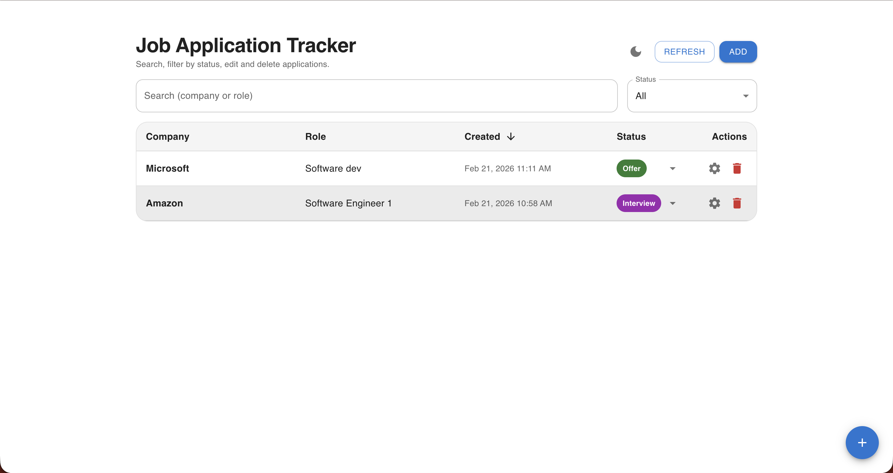
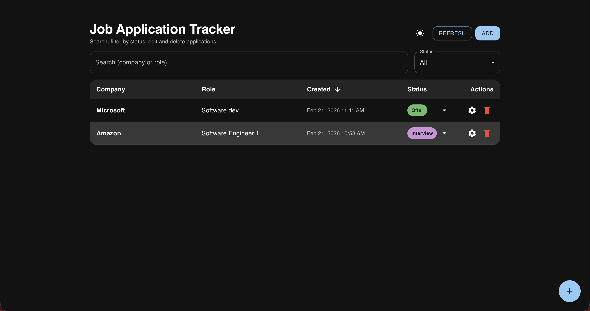
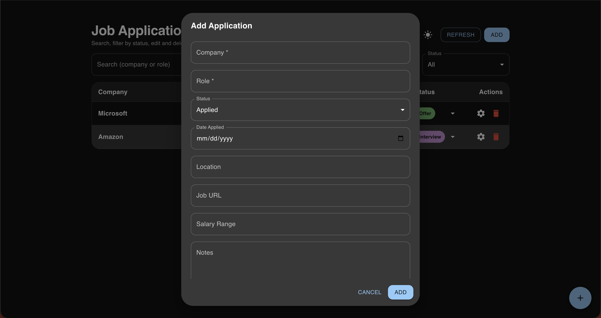

# Job Application Tracker

A full-stack job application tracker built with React, FastAPI, and
PostgreSQL. This project allows users to manage job applications with a
modern UI, real-time updates, filtering, editing, and status tracking.
Designed to demonstrate production-style full-stack development, REST
API design, database integration, and Docker-based deployment.

------------------------------------------------------------------------

## Screenshots

### Light Mode

### Dark Mode

### Add Application Modal

------------------------------------------------------------------------

## Features

-   Add, edit, and delete job applications
-   Update application status (Applied, Interview, Offer, Rejected)
-   Search applications by company or role
-   Filter applications by status
-   Sort applications by creation date
-   Dark mode toggle
-   Responsive modern UI using Material UI
-   REST API backend built with FastAPI
-   PostgreSQL relational database
-   Fully Dockerized for easy setup and deployment

------------------------------------------------------------------------

## Tech Stack

### Frontend

-   React
-   Vite
-   Material UI
-   Axios

### Backend

-   FastAPI
-   Python
-   SQLAlchemy
-   Pydantic

### Database

-   PostgreSQL

### DevOps / Tools

-   Docker
-   Docker Compose
-   Git
-   GitHub

------------------------------------------------------------------------

## Getting Started

### Prerequisites

Install the following:

-   Docker
-   Docker Desktop
-   Git

------------------------------------------------------------------------

### Installation and Setup

Clone the repository:

git clone https://github.com/YOUR_USERNAME/job-tracker.git cd
job-tracker

Build and start the containers:

docker compose up --build

------------------------------------------------------------------------

## Access the Application

Frontend: http://localhost:5173

Backend API: http://localhost:8000

Interactive API Documentation (Swagger UI): http://localhost:8000/docs

------------------------------------------------------------------------

## Project Structure

job-tracker/ ├── backend/ \# FastAPI backend ├── frontend/ \# React
frontend ├── docker-compose.yml ├── README.md └── .gitignore

------------------------------------------------------------------------

## Example API Request

POST /applications

Example body:

{ "company": "Google", "role": "Software Engineer", "status": "Applied"
}

------------------------------------------------------------------------

## Development Goals

This project was built to demonstrate:

-   Full-stack web development
-   REST API design and implementation
-   Database schema design and integration
-   Modern frontend UI development
-   Docker containerization
-   Real-world CRUD application architecture

------------------------------------------------------------------------

## Future Improvements

-   User authentication and login system
-   Per-user job tracking
-   Cloud deployment
-   Email reminders and notifications
-   Analytics dashboard
-   Export applications to CSV

------------------------------------------------------------------------

## License

This project is licensed under the MIT License.

------------------------------------------------------------------------

## Author

Built by Chase Kimball as part of a software development portfolio
project.
